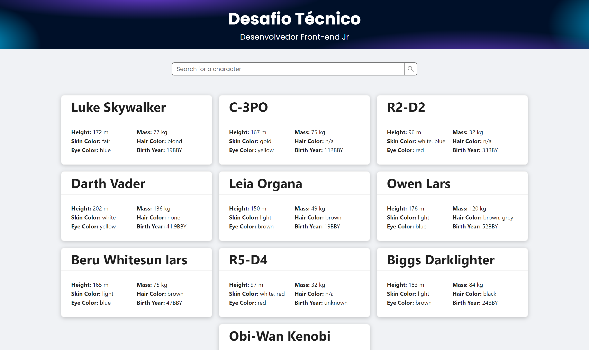

<h1 align="center">Star Wars Caracters</h1>

<p align="center">
    
</p>

## Introduction

This is a web application that lists the character of star Wars.

It was created as a challenge project for [Smartnx](https://www.smartnx.com/) in a selective process.




## Technologies

- [React](https://reactjs.org/)
- [Next.js](https://nextjs.org/)
- [TypeScript](https://www.typescriptlang.org/)
- [Jest](https://jestjs.io/)
- [React Testing Library](https://testing-library.com/docs/react-testing-library/intro/)
- [Faker](https://fakerjs.dev/)
- [ESLint](https://eslint.org/)
- [Ant Design](https://ant.design/)


## Installation

1. Download [Docker](https://www.docker.com/products/docker-desktop/) to run this app

2. Clone the repository
```bash
git clone https://github.com/Pedro2091/star-wars-caracters.git
```
3. Create the Docker containers
```bash
docker-compose build 
```

## How to run development environment 

- Run the Docker development container
```bash
docker-compose up dev
```

## How to run tests 

- Run the set of tests
```bash
docker-compose run --rm test
```

## How to stop a container

- Run the stop command
```bash
docker stop [dev | test]
```
